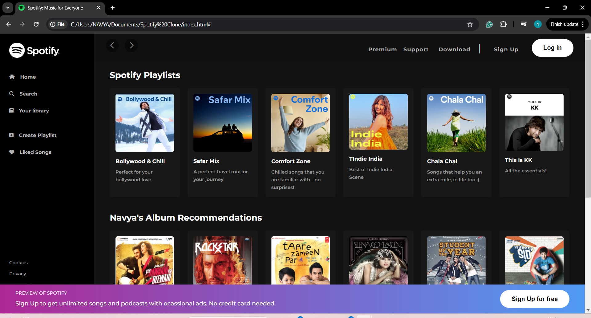

# Spotify Clone
## Description
This is a simple HTML/CSS project aiming to replicate the layout and design of the Spotify web application.



## Features
- **Responsive design:** The layout adjusts to different screen sizes, making it accessible on various devices.
- **Sidebar navigation:** Mimics Spotify's sidebar navigation for easy access to different sections.
- **Playlist display:** Displays playlists with cover images and song information.
- **Sign up and login buttons:** Provides options for users to sign up or log in to their accounts.

## Getting Started
To get a local copy up and running, follow these simple steps:
1. Clone the repo:
    ```
    git clone https://github.com/NavyaNayer/Spotify-Clone.git
    ```
2. Open the `index.html` file in your browser.

## Acknowledgments
- [Font Awesome](https://fontawesome.com/) for the icons used in the project.
- [Google Fonts](https://fonts.google.com/) for the fonts used in the project.
